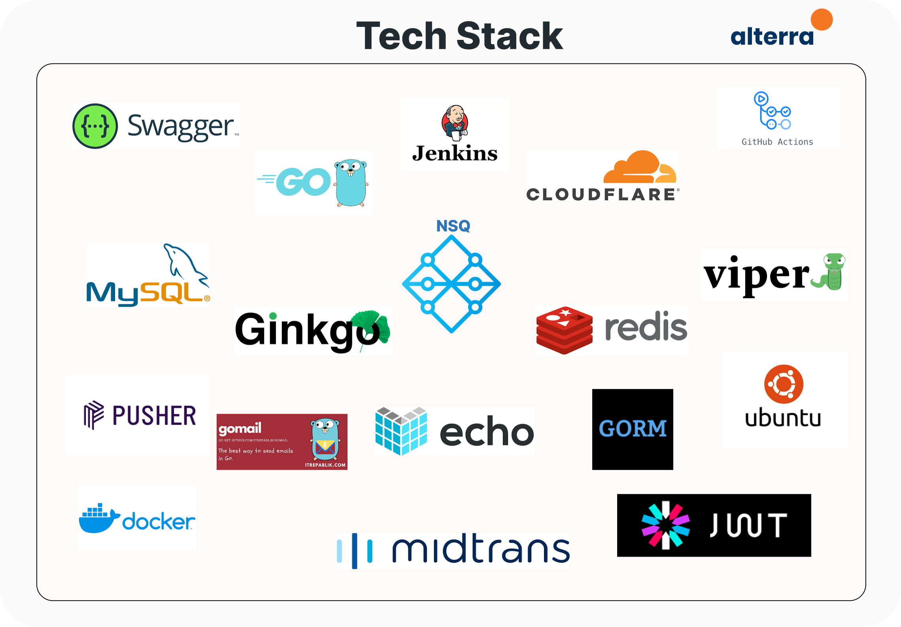
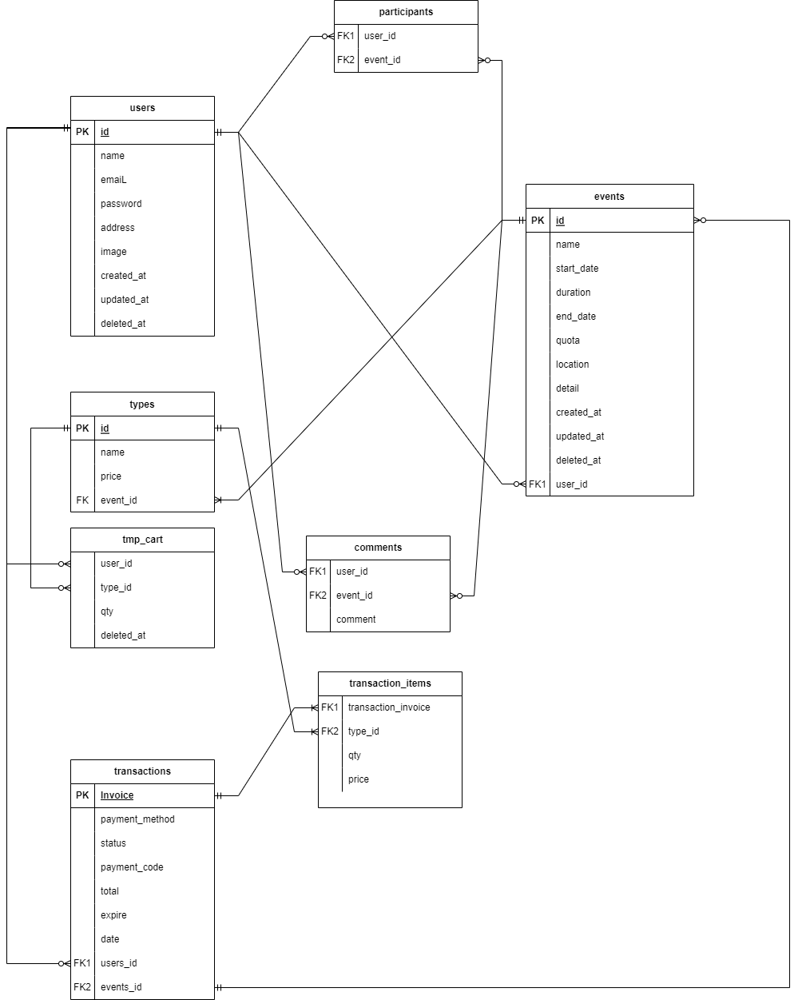

# Ticket Event Shop

<div align="center">
  <p>
    Ticket Event Shop
  </p>

  <p align="center">
    Group Project 3 Unit 2
    <br />
    <a href="https://app.swaggerhub.com/apis/ropel12/tes/1.0.0"><strong>| Open API Documentation |</strong></a>
    <br />
    <br />
  </p>
</div>

## 🧑‍💻 About the Project

<p align="justify">Event Ticket Shop is a web application-based online market place for selling event ticket. Users can also discuss with other users about the event to be held. Here you can sell paid or free tickets. We implement midtrans for payment gateway</p>


## 🛠 Technology Stack
<div align="center">



  </div>

# 🔗 ERD

<div align="center">

  </div>

  # ⚡ Features

<details>
  <summary>🎫 Auth</summary>
  
| Method      | Endpoint            | Params      |q-Params            | JWT Token   | Function                                |
| ----------- | ------------------- | ----------- |--------------------| ----------- | --------------------------------------- |
| POST        | /register           | -           |-                   | NO         | Register a new User                |
| POST        | /login      | -           |-                   | NO         | Login to the system        |
  
</details>

<details>
  <summary>🙍‍♂️ Users</summary>
  
| Method      | Endpoint            | Params      |q-Params            | JWT Token   | Function                                |
| ----------- | ------------------- | ----------- |--------------------| ----------- | --------------------------------------- |
| GET        | /users           | -           |-                   | YES         | Show profile                |
| PUT        | /users      | -           |-                   | YES         | Update profile data        |
| DELETE        | /users      | -           |-                   | YES         | Delete user data        |
| GET        | /users/events      | -           |-                   | YES         | Show list user event's        |
| GET        | /users/history      | -           |-                   | YES         | Show history        |
| GET        | /users/transaction      | -           |-                   | YES         | show data of user ticket's        |
</details>

<details>
  <summary>🕺Events</summary>
  
| Method      | Endpoint            | Params      |q-Params            | JWT Token   | Function                                |
| ----------- | ------------------- | ----------- |--------------------| ----------- | --------------------------------------- |
| PUT        | /events      | -           |-                   | YES         | Update event data        |
| POST        | /events      | -           |-                   | YES         | Post new event        |
| GET        | /events           | -           |-                   | YES         | Show all events                |
| DELETE        | /events/{id_event}     | id_event           |-                   | YES         | Delete event by ID        |
| GET        | /events/{id_event}      | id_event           |-                   | YES         | Show detail event        |
| POST        | /events/participant      | -           |-                   | YES         | Join the event        |
</details>

<details>
  <summary>👋 Events Participants</summary>
  
| Method      | Endpoint            | Params      |q-Params            | JWT Token   | Function                                |
| ----------- | ------------------- | ----------- |--------------------| ----------- | --------------------------------------- |
| POST        | /comments           | -           |-                   | YES         | Create a new comment                |
  
</details>

<details>
  <summary>🛍️ Transactions</summary>
  
| Method      | Endpoint            | Params      |q-Params            | JWT Token   | Function                                |
| ----------- | ------------------- | ----------- |--------------------| ----------- | --------------------------------------- |
| POST        | /transaction/checkout           | -           |-                   | YES         | User checkout products                |
| POST        | /transactions/cart      | -           |-                   | YES         | User add products to cart        |
| GET        | /transactions/cart      | -           |-                   | YES         | User show their products in cart        |
| GET        | /transactions/{invoice}      | -           | invoice                   | YES         | Show User invoices        |
  
</details>

<details>
  <summary>🎟️ Tickets</summary>
  
| Method      | Endpoint            | Params      |q-Params            | JWT Token   | Function                                |
| ----------- | ------------------- | ----------- |--------------------| ----------- | --------------------------------------- |
| POST        | /tickets           | -           |-                   | YES         | Post new ticket                |
| DELETE        | /tickets/{id_ticket}      | -           |-                   | YES         | Delete ticket by ID        |
| GET        | /tickets/{invoices}      | -           | invoice                   | YES         | Show all tickets        |
  
</details>

## How to Install To Your Local And Run

- Clone it

```
$ git clone https://github.com/ropel12/project-3
```

- Go to directory

```
$ cd project-3
```

- Run the project

```
$ go run .
```

- Voila! 🪄